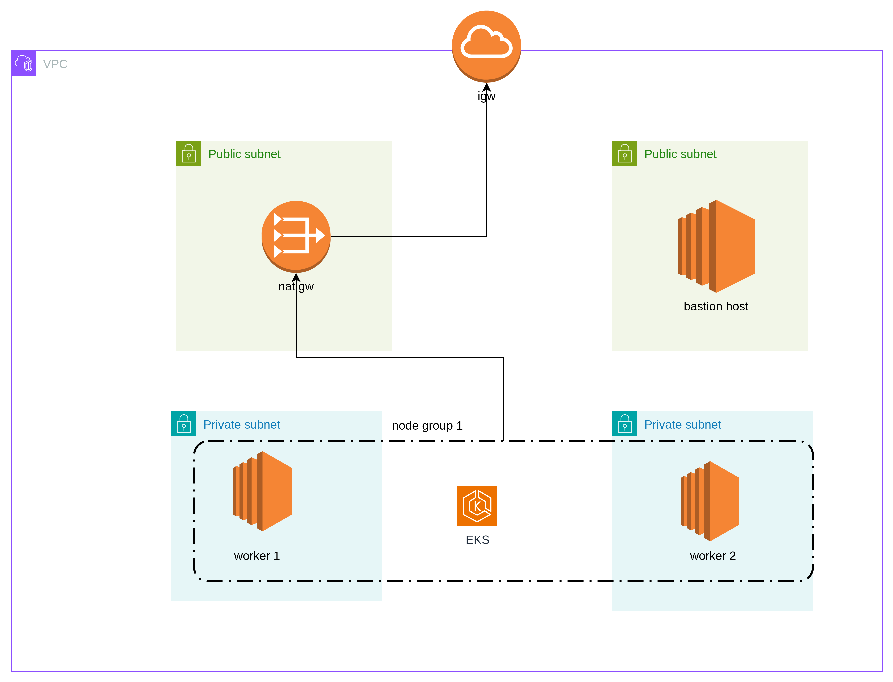

# EKS Cluster for Development

Take Home Challenge to create k8s cluster for dev purposes that contains:
1. Network Setup and Kubernetes (k8s) Cluster Setup
2. Deployment Engine
3. Ingress
4. Metrics Stack

## Technology Stack
1. AWS EKS.
2. Terraform for IAC.
3. AWS ALB Controller for Ingress.
4. Prometheus-grafana stack for monitoring.

## Tooling
make sure you have the following tools installed.
- AWS cli
- eksctl
- curl
- terraform
- kubectl

# Network Topology


- AWS Region: us-east-1
- VPC with 2 public, 2 private subnets
- Internet gateway
- Nat gateway
- Private route table, public route table
- bastion host security group

## Summary
```
# clone the repo
# to provision the cluster configure the aws cli tools with user creds or export them as env vars
# replace <aws-account-id> with your account id

cd aws_eks
./provisioin.sh <aws-account-id>

```

## Detailed steps
- clone the git repo.
- move to aws_eks directory
- make `provision.sh` executable
- configure aws cli with one of 2 ways:
    - export aws credentials as env vars.
    - run aws configure and provide your credentials.
- run `provision.sh` with your aws account id as argument.
- wait for script to complete.
- to get the grafana ingress public url: `kubectl get ingress grafana -n monitoring`. if the address is not working, wait sometime until AWS ALB is provisioned.
- grafana default creds: 
    - username: `admin`
    - password: run this to get the password `kubectl --namespace monitoring get secrets prometheus-grafana -o jsonpath="{.data.admin-password}" | base64 -d ; echo
`
    - change the default password after successfule login

## provision.sh
simple script to automate the cluster creation process, LBC installation, Prometheus and grafana setup.

1. provisions aws network as described above.
2. create eks cluster named `dev-cluster` in `us-east-1`.
3. install prometheus-stack helm chart for metrics.
4. install aws ALB controller for ingress.
5. expose the internal grafana svc via ingress to public.